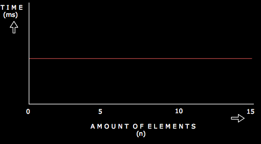

Constant runtime O(1) / time complexity is the term used to refer to an algorithm which will always execute in the same
amount of time regardless of the amount of data or input fed into it.

Here are a few examples
* Getting the first element of an array
* Popping an item off a stack
* Creating a function that takes no arguments and returns "Hello World"

There is something common among these operations: they do not depend on the size of any data or input and hence, they are
constant time or they have a Big O of **O(1)** .

Let me use the third example to further illustrate. Oh and I'll be using JavaScript for all my code examples but they're
fairly straightforward and easy to implement in other languages as well.

```javascript
function sayHello() {
  return "Hello World";
}
 ``` 

<br />

With this **sayHello** function, it will always run in the same amount of time regardless of whatever is passed into it.
Let's assume for some funny reason you decide to pass in an array as a parameter. The code will then look something like this.

```javascript
const numbers = [1, 2, 3, 4, 5];

function sayHello(array) {
  return "Hello World";
}

console.log(sayHello(numbers));
 ``` 
<br />

The **sayHello** function will still run in the same time because it does not make use of the elements in the 
**numbers** array for any of its operations. The **numbers** array could contain as many as 500 elements and it still
won't affect how **sayHello** runs. This is why it as a Big O of **O(1)**.

Let's take another example. Say we have 3 arrays of different length. Let's write a simple program to access the first
element of each array.

```javascript
const array1 = [1, 2, 3, 4, 5];
const array2 = [0, 10];
const array3 = [50,60,70,80,90,100,110,120,130];

console.log(array1[0]);
console.log(array2[0]);
console.log(array3[0]);
 ``` 

<br />

For all the three arrays, it takes the same amount of time to access the first element eventhough they are of different
sizes. This is why accessing the first element of an array is considered a constant time process.

<br /> 

Below is a graph that shows how a constant time algorithm varies with time



<br />

The next topic we'll look at is the Linear runtime or O(n). Until then, Happy Coding! :punch:

## References
1. <a href="https://gumroad.com/l/aUVXY" target="_blank" rel="noopener noreferrer">Decoding the Coding Interview Process by Emma Bostian</a>
2. <a href="https://www.theavocoder.com/big-o-notation/2018/12/22/constant-o1" target="_blank" rel="noopener noreferrer">Theavocoder - Constant O(1)</a>
