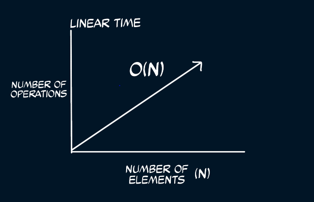

Linear runtime O(n) / time complexity is a term applied to algorithms whose performance and time complexity grow linearly and
proportionally with the size of the input or data.

A typical example of a linear runtime operation is an array.

```javascript
const array = [1,2,3,4,5];

function printNumbers(numbersArray){
  for (let number of numbersArray) {
    console.log(number);
  }
}

printNumbers(array);
 ``` 

<br />

The for-loop runs once for each element inside the array. Since we have 5 elements inside the array, it runs 5 times.
Let's take the length of any array passed into the function to equal **n**. If that's the case we can say that our **printNumbers**
function has a Big O of O(n) or a linear runtime.

Array methods like .map(), .forEach(), .filter(), and cloning an array using the spread operator are all examples of linear
runtime operations.

Running a task for each item in an array mostly has a linear runtime provided that task does not contain nested loops. Nested
loops lead to a different kind of runtime complexity which we will discuss later.

Below is a graph showing how O(n) operations vary with increasing number of elements

 

<br />

Later we'll have a look at the Quadratic or Polynomial runtime. Until then, Happy Coding! :punch:

<br />

## References
1. <a href="https://gumroad.com/l/aUVXY" target="_blank" rel="noopener noreferrer">Decoding the Coding Interview Process by Emma Bostian</a>
2. <a href="https://www.theavocoder.com/big-o-notation/2018/12/22/constant-o1" target="_blank" rel="noopener noreferrer">Theavocoder - Linear O(n)</a>
