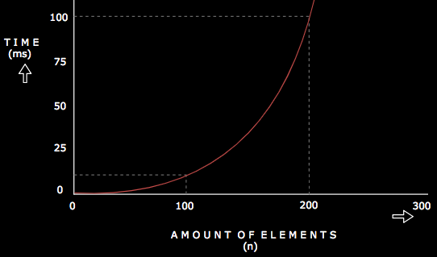

# Quadratic Runtime or O(n<sup>2</sup>)

It basically describes an algorithm whose performance or runtime is proportional to the square of the size of the input
or data. this is mostly found in algorithms that make use of nested loops.

Some just refer to this as the Polynomial runtime since **n<sup>2</sup>** is a polynomial.

An example of the quadratic runtime can be seen in algorithms such as the bubble sort algorithm which we will talk about
way later.

For now let's take a look at relatively simpler example. Given an array, we just want to console log the items of the array
in pairs. So let's say we have an array containing [1,2], we want to console log **(1,1), (1,2), (2,1) and (2,2)**. 

Consider the example below.

```javascript
let array = [1,2,3,4,5];

for (let i = 0; i < array.length; i++){
    for (let j = 0; j < array.length; j++) {
        console.log(array[i],array[j])
    }
}
 ```

<br />

In this example we're looping through the array for each element like we did with the Linear runtime. But watch carefully.
We have another for loop within the first one. This means that for each element of the array, we loop over the whole array
all over again. So we console log the current element in the loop with every other element in that same loop. 

In short, we have to loop over n elements and for every element, we have to loop over n elements. This results in an n * n number of
operations. This is what is termed as an algorithm having a quadratic time complexity  (Big O of **O(n)<sup>2</sup>**).

Below is a graph showing the performance of a **O(n)<sup>2</sup>** algorithm as the number of inputs increase.

<br />

 

<br />

Next, we'll consider the Logarithmic runtime. Until then, Happy Coding! :punch:

<br />

## References
1. <a href="https://gumroad.com/l/aUVXY" target="_blank">Decoding the Coding Interview Process by Emma Bostian</a>
2. <a href="https://www.theavocoder.com/big-o-notation/2018/12/22/quadratic-on2" target="_blank">Theavocoder - Quadratic O(n)<sup>2</sup></a>
